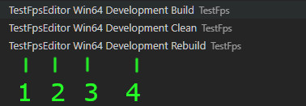
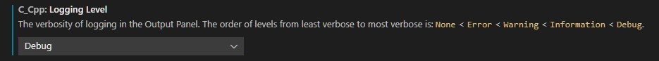

# Unreal VSCode diy config check

#### ***Version 0.0.6***

*How to check for certain errors with the VSCode Microsoft C++ (cpptools) extension and an Unreal Engine configuration.*


VSCode's/cpptools extension has config files and logs that lets you  check if your Unreal config is valid. These checks would be for:
- Include Errors
- Compiler Path
- IntellisenseMode
- Cpp Standard

### This guide will hopefully help you check if your settings and configs are correct.

---
---
## Table of Contents
### [Info](#info)
### [Prerequisites](#prerequisites-1)
### [Include Errors](#include-errors-1)
### [Compiler Path](#compiler-path-setting)
### [Intellisense Mode](#intellisense-mode-1)
### [C++ Standard](#c-standard-1)
### [New File Errors](#new-file-errors-1)
### [Resetting Project](#resetting-project-1)

---
---
# Info
*Good to know info*

## Intellisense Engines
The MS C++ extension has two different Intellisense engines.
### Default
- Context aware
- Slow with large header files
- Also uses Tag Parser for some actions
- Uses Fire Symbol when active (shown below)
### Tag Parser
- Fast
- Symbols only(not smart)
- No error detection
- Can take 15+ minutes when parsing symbols(1st time only)
- Uses Cylinder icon when active (shown below)


---
---
# Prerequisites
*Stuff to do before checking config*

## Install My Extension
This extension fixes problems with the Unreal configuration for VSCode for the Microsoft C++ extension.
[https://gist.github.com/boocs/f63a4878156295b6e854cac68672f305](https://gist.github.com/boocs/f63a4878156295b6e854cac68672f305)


## Building with correct Build Task
You can find Build Tasks in VSCode's Terminal menu with the 'Run Build Task...' choice.

There's a certain Build Task that needs to be run.
This Build Task creates project directories and files used for Intellisense.

This Build Task is the 'Editor suffix' Development task. It's easy to find

1. Project Name (TestFps)
2. 'Editor' suffix after project name. (Project will start in the Unreal Editor)
3. Platform to build for (will probably be different for Mac/Linux)
4. Development [(Build Config)](https://docs.unrealengine.com/5.0/en-US/build-configurations-reference-for-unreal-engine/)

There are three Build task choices: Build, Clean, and Rebuild. You should almost alway choose 'Build'. Choose Rebuild only if there are major problems.

*Note: Rebuild with the full Unreal Source will take awhile.*

## Enable C++ extension(cpptools) logging
*Can see what the C++ extension is doing in real time*

### To Enable loging go into the settings and change logging to Debug like so:


### To access the logs go to the Terminal's Output setting and change it to C/C++ like so:


*Note: You can turn off the C++ logging after you're done with this guide*

---
---
# Include Errors
*Checking for directories that are suppose to be included*
```
A lots of include errors can be resolved by resetting your project(Generating Project Files) See guide section below on how to do this(TODO)
```

### Missing includes are easy to check for by using the C++ logs mentions in the Prerequisites section of this guide.

Parsing the log can be difficult but can be made easy by following these steps.
1. Open your project and make sure both Intellisense icons are not active

    *Remember that the Tag Parser, when first run, can take awhile to turn off*

2. With your project open, open your project's /.vscode/c_cpp_properties.json

    *We do this to show only the Tag Parser logs when first opening VSCode*

3. Restart VSCode

    *You should see your c_cpp_properties.json file contents and no other file contents.*

4. Look at the C/C++ logs

## What the C/C++ logs show

### Compiler Path
```
Attempting to get defaults from C++ compiler in "compilerPath" property: 'C:\Program Files (x86)\Microsoft Visual Studio\2022\BuildTools\VC\Tools\MSVC\14.32.31326\bin\HostX64\x64\cl.exe'
```
If anything is wrong with the compiler path the logs will show it here or near here.

*Note: You may get a bunch of the compiler path lines above*

## Tag Parser Intellisense
The Tag Parser will gather a list of a includes from all workspaces and then combine them into one list. The list will appear like so:
```
Processing folder (non-recursive): C:/PROGRAM FILES (X86)/MICROSOFT VISUAL STUDIO/2022/BUILDTOOLS/VC/TOOLS/MSVC/14.32.31326/INCLUDE
Processing folder (recursive): E:/PROGRAM FILES/EPIC GAMES/UE_5.0/ENGINE/INTERMEDIATE/BUILD/WIN64/UNREALEDITOR/INC/ADVANCEDPREVIEWSCENE/
Processing folder (recursive): E:/PROGRAM FILES/EPIC GAMES/UE_5.0/ENGINE/INTERMEDIATE/BUILD/WIN64/UNREALEDITOR/INC/ADDCONTENTDIALOG/
```
*Note: Most paths should show up as recursive*

These paths can tell us a lot about missing include paths as explained below:


### System includes
```
Processing folder (non-recursive): C:/PROGRAM FILES (X86)/MICROSOFT VISUAL STUDIO/2022/BUILDTOOLS/VC/TOOLS/MSVC/14.32.31326/INCLUDE
Processing folder (recursive): C:/PROGRAM FILES (X86)/WINDOWS KITS/10/INCLUDE/10.0.22621.0/CPPWINRT/
Processing folder (recursive): C:/PROGRAM FILES (X86)/WINDOWS KITS/10/INCLUDE/10.0.22621.0/SHARED/
Processing folder (recursive): C:/PROGRAM FILES (X86)/WINDOWS KITS/10/INCLUDE/10.0.22621.0/UCRT/
Processing folder (recursive): C:/PROGRAM FILES (X86)/WINDOWS KITS/10/INCLUDE/10.0.22621.0/UM/
Processing folder (recursive): C:/PROGRAM FILES (X86)/WINDOWS KITS/10/INCLUDE/10.0.22621.0/WINRT/
```
*These are the Windows system includes. Linux/Mac users may or may not have these listed. They will be totally different though! Any Linux/Mac users let me know if you find them and post what they are so I can list them here.*

### Project includes
*Includes from your project's directory*
```
1. Processing folder (recursive): D:/USERS/ME/DOCUMENTS/UNREAL PROJECTS/TESTFPS/SOURCE/
2. Processing folder (recursive): D:/USERS/ME/DOCUMENTS/UNREAL PROJECTS/TESTFPS/INTERMEDIATE/BUILD/WIN64/UNREALEDITOR/INC/TESTFPS/
3. Processing folder (recursive): D:/USERS/ME/DOCUMENTS/UNREAL PROJECTS/TESTFPS/INTERMEDIATE/BUILD/WIN64/UNREALEDITOR/DEVELOPMENT/TESTFPS/
4. Processing folder (recursive): D:/USERS/ME/DOCUMENTS/UNREAL PROJECTS/TESTFPS/INTERMEDIATE/BUILD/WIN64/TESTFPSEDITOR/DEVELOPMENT/ENGINE/
```
1. Project's Source directory
2. *.generated.h and *.gen.cpp files (Most of your project's headers will have these headers included)
3. Definitions.TestFps.h (Definitions.ProjectName.h)
4. SharedPCH.Engine.*.h (I could see Unreal non-Unity builds not having this. Let me know!)

*Note: Numbers won't be in the log*

**You should have all these. There could be a scenario where these might not exist but I'd be worried if you don't have them. Remember TestFps is my project name. Your paths will be different but similiar.**

*Extra Project Includes (Public/Private)*
```
You may also have Public and Private project includes if using Unreal's Public/Private subdirectory system. If you are using these Unreal Created subdirectories and don't have these listed then you should reset your project to add them to your project's config.
```
## Default Intellisense
*Checking what the Default Intellisense C++ logs tell us*
### *TODO*

---
---
# Compiler Path Setting
### *TODO*

---
---
# Intellisense Mode
### *TODO*

---
---
# C++ Standard
### *TODO*

---
---
# New File Errors
### *TODO*

---
---
# Resetting Project
### *TODO*

---
---
[Back To Top](#Unreal-VSCode-diy-config-check)